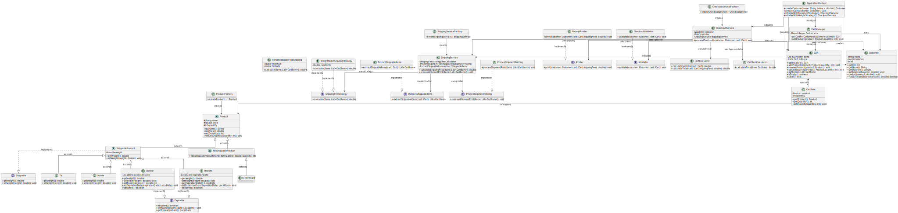
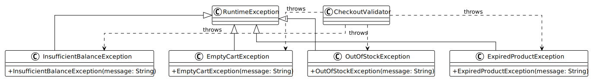

# 🛒 E-Commerce Checkout System

[](https://openjdk.java.net/)
[](LICENSE)
[](https://blog.cleancoder.com/uncle-bob/2012/08/13/the-clean-architecture.html)
[]()

A robust, scalable E-commerce checkout system built with **Clean Architecture** principles, demonstrating advanced **Object-Oriented Programming** concepts and **SOLID** design patterns. This project showcases a complete checkout workflow with product management, cart operations, shipping calculations, and comprehensive validation.

## 📋 Table of Contents

- [Features](#-features)
- [Architecture](#-architecture)
- [UML Diagrams](#-uml-diagrams)
- [Project Structure](#-project-structure)
- [Installation](#-installation)
- [Usage](#-usage)
- [SOLID Principles Implementation](#-solid-principles-implementation)
- [Design Patterns](#-design-patterns)
- [Testing](#-testing)
- [Contributing](#-contributing)
- [License](#-license)

## ✨ Features

### 🛍️ Core Functionality
- **Product Management**: Support for various product types (perishable, shippable, digital)
- **Shopping Cart**: Dynamic cart with item management and quantity tracking
- **Checkout Process**: Complete checkout workflow with validation
- **Shipping Integration**: Automatic shipping fee calculation and processing
- **Customer Management**: Balance tracking and payment processing

### 🏗️ Technical Features
- **Clean Architecture**: Separation of concerns with domain, application, and infrastructure layers
- **SOLID Principles**: Well-structured, maintainable, and extensible codebase
- **Exception Handling**: Comprehensive error management with custom exceptions
- **Type Safety**: Strong typing with interfaces and abstract classes
- **Modular Design**: Loosely coupled components for easy testing and maintenance

### 📦 Product Types Supported
| Product Type | Examples | Characteristics |
|-------------|----------|-----------------|
| **Perishable & Shippable** | Cheese, Biscuits | Expiration date, weight-based shipping |
| **Non-Perishable & Shippable** | TV, Mobile | Weight-based shipping, no expiration |
| **Digital/Non-Shippable** | Scratch Cards | No shipping required |

## 🏛️ Architecture

This project follows **Clean Architecture** principles with clear separation of concerns:

```
┌─────────────────────────────────────────────────────────────┐
│                    Application Layer                        │
├─────────────────────────────────────────────────────────────┤
│  CheckoutService │ ShippingService │ CartCalculator        │
└─────────────────────────────────────────────────────────────┘
                              │
┌─────────────────────────────────────────────────────────────┐
│                     Domain Layer                            │
├─────────────────────────────────────────────────────────────┤
│  Product │ Customer │ Cart │ CartItem │ Interfaces         │
└─────────────────────────────────────────────────────────────┘
                              │
┌─────────────────────────────────────────────────────────────┐
│                   Exception Layer                           │
├─────────────────────────────────────────────────────────────┤
│  Custom Exceptions for Business Logic Validation           │
└─────────────────────────────────────────────────────────────┘
```

### Key Design Patterns
- **Strategy Pattern**: Different product behaviors (shipping, expiration)
- **Template Method**: Abstract product classes with common functionality
- **Dependency Injection**: Services injected into checkout process
- **Single Responsibility**: Each class has a specific, well-defined purpose

## 📊 UML Diagrams

This project includes comprehensive UML class diagrams that visualize the system architecture and relationships:

### 🏗️ Complete System Architecture


**Features:**
- Complete system overview with all classes and relationships
- Inheritance hierarchies for products
- Interface implementations
- Service dependencies and associations
- Exception handling relationships

### 🚨 Exception Handling Architecture


**Features:**
- **Custom Exception Hierarchy**: All business exceptions extending `RuntimeException`
- **Exception Types**: 
  - `OutOfStockException` - When product quantity is insufficient
  - `ExpiredProductException` - When product has expired
  - `InsufficientBalanceException` - When customer balance is insufficient
  - `EmptyCartException` - When cart is empty during checkout
- **Exception Usage**: Shows which classes throw which exceptions
- **Validation Flow**: Demonstrates how `CheckoutValidator` uses exceptions for business rule validation

**Exception Flow:**
```
CheckoutValidator
    ├── throws OutOfStockException (product quantity < requested)
    ├── throws ExpiredProductException (product.isExpired() == true)
    ├── throws InsufficientBalanceException (customer.balance < total)
    └── throws EmptyCartException (cart.isEmpty() == true)
```

**Benefits:**
- **Type Safety**: Specific exception types for different error scenarios
- **Error Handling**: Clear distinction between different validation failures
- **Debugging**: Easy identification of what went wrong during checkout
- **User Experience**: Specific error messages for different failure cases

## 📁 Project Structure

```
src/
├── domain/                          # Core business logic
│   ├── cart/
│   │   └── entity/
│   │       ├── Cart.java           # Shopping cart implementation
│   │       └── CartItem.java       # Individual cart items
│   │
│   ├── customer/
│   │   └── entity/
│   │       └── Customer.java       # Customer entity with balance
│   │
│   ├── product/
│   │   ├── entity/                 # Concrete product implementations
│   │   │   ├── Cheese.java
│   │   │   ├── Biscuits.java
│   │   │   ├── TV.java
│   │   │   ├── Mobile.java
│   │   │   └── ScratchCard.java
│   │   │
│   │   ├── interfaces/             # Product behavior contracts
│   │   │   ├── Shippable.java
│   │   │   └── Expirable.java
│   │   │
│   │   └── type/                   # Abstract product categories
│   │       ├── Product.java        # Base product class
│   │       ├── ShippableProduct.java
│   │       └── NonShippableProduct.java
│   │
│   └── exception/                  # Custom business exceptions
│       ├── OutOfStockException.java
│       ├── ExpiredProductException.java
│       ├── InsufficientBalanceException.java
│       └── EmptyCartException.java
│
├── application/                     # Business logic orchestration
│   ├── checkout/
│   │   ├── CheckoutService.java    # Main checkout orchestration
│   │   ├── CheckoutValidator.java  # Validation logic
│   │   └── ReceiptPrinter.java     # Receipt generation
│   │
│   ├── shipping/
│   │   ├── ShippingService.java    # Shipping orchestration
│   │   ├── ShippingFeeStrategy.java # Strategy interface
│   │   ├── WeightBasedShippingStrategy.java
│   │   ├── ThresholdBasedFreeShipping.java
│   │   ├── ProcessShipmentPrinting.java
│   │   └── ExtractShippableItems.java
│   │
│   │
│   └── cart/
│       └── CartCalculator.java     # Cart calculations
│
└── Main.java                       # Application entry point
```

### Example Usage

```java
// Create customer and cart
Customer customer = new Customer("John Doe", 1000.0);
Cart cart = new Cart();

// Add products to cart
Cheese cheese = new Cheese("Aged Cheddar", 15.99, 5, 0.5, LocalDate.of(2024, 12, 31));
TV tv = new TV("Smart TV 55\"", 599.99, 2, 15.0);
cart.addProduct(cheese, 2);
cart.addProduct(tv, 1);

// Process checkout
ShippingService shippingService = new ShippingService();
CheckoutService checkoutService = new CheckoutService(shippingService);
checkoutService.processCheckout(customer, cart);
```

### Sample Output

```
=== CHECKOUT RECEIPT ===
Customer: John Doe (ID: 1)
Date: 2024-01-15

Items:
- Aged Cheddar (2x) - $31.98
- Smart TV 55" (1x) - $599.99

Subtotal: $631.97
Shipping Fees: $45.00
Total: $676.97

=== SHIPPING NOTICE ===
Shipping the following items:
- Aged Cheddar (2x) - Weight: 1.0kg
- Smart TV 55" (1x) - Weight: 15.0kg

Checkout completed successfully!
```

## 🎯 SOLID Principles Implementation

This project demonstrates a comprehensive implementation of **SOLID** principles throughout the codebase:

### 1. **S** - Single Responsibility Principle (SRP)

Each class has **one reason to change** and **one responsibility**:

#### ✅ **Well-Implemented Examples:**

**`CheckoutService.java`**
```java
public class CheckoutService {
    // Single Responsibility: Orchestrate the checkout process
    public void processCheckout(Customer customer, Cart cart) {
        validator.validate(customer, cart);           // Delegates validation
        // ... shipping processing
        printer.print(customer, cart, shippingFees);  // Delegates printing
    }
}
```

**`CheckoutValidator.java`**
```java
public class CheckoutValidator {
    // Single Responsibility: Validate business rules
    public void validate(Customer customer, Cart cart) {
        // Only handles validation logic
    }
}
```

**`ReceiptPrinter.java`**
```java
public class ReceiptPrinter {
    // Single Responsibility: Print receipts
    public void print(Customer customer, Cart cart, double shippingFees) {
        // Only handles receipt formatting and printing
    }
}
```

**`ShippingService.java`**
```java
public class ShippingService {
    // Single Responsibility: Handle shipping operations
    public List<CartItem> extractShippableItems(Cart cart) { /* ... */ }
    public double calculateShippingFees(List<CartItem> items) { /* ... */ }
    public void processShipment(List<CartItem> items) { /* ... */ }
}
```

### 2. **O** - Open/Closed Principle (OCP)

The system is **open for extension** but **closed for modification**:

#### ✅ **Extension Points:**

**Product Hierarchy**
```java
// Base class - closed for modification
public abstract class Product {
    // Common functionality
}

// New product types can be added without modifying existing code
public class NewProduct extends ShippableProduct {
    // Extends functionality without changing base classes
}
```

**Interface Implementations**
```java
// New behaviors can be added through interfaces
public interface Shippable {
    double getweight();
    void setweight(double weight);
}

public interface Expirable {
    boolean isExpired();
    LocalDate getExpirationDate();
}

// Products can implement multiple interfaces
public class Cheese extends ShippableProduct implements Expirable {
    // Implements both shipping and expiration behaviors
}
```

### 3. **L** - Liskov Substitution Principle (LSP)

Subtypes are **substitutable** for their base types:

#### ✅ **Proper Substitution:**

**Product Substitution**
```java
// Any Product subtype can be used where Product is expected
Product product1 = new Cheese("Cheddar", 10.0, 5, 0.5, LocalDate.now());
Product product2 = new TV("Smart TV", 500.0, 2, 15.0);
Product product3 = new ScratchCard("Gift Card", 50.0, 10);

// All work seamlessly in the cart system
cart.addProduct(product1, 2);
cart.addProduct(product2, 1);
cart.addProduct(product3, 3);
```

**Interface Substitution**
```java
// Shippable products can be used interchangeably
List<Shippable> shippableItems = new ArrayList<>();
shippableItems.add(new Cheese("Cheese", 10.0, 5, 0.5, LocalDate.now()));
shippableItems.add(new TV("TV", 500.0, 2, 15.0));

// Shipping service works with any Shippable implementation
shippingService.calculateShippingFees(shippableItems);
```

### 4. **I** - Interface Segregation Principle (ISP)

Clients are **not forced to depend** on interfaces they don't use:

#### ✅ **Focused Interfaces:**

**`Shippable` Interface**
```java
// Only methods related to shipping
public interface Shippable {
    double getweight();
    void setweight(double weight);
}
```

**`Expirable` Interface**
```java
// Only methods related to expiration
public interface Expirable {
    boolean isExpired();
    void setExpirationDate(LocalDate date);
    LocalDate getExpirationDate();
}
```

**Product Implementations**
```java
// Products only implement interfaces they need
public class Cheese extends ShippableProduct implements Expirable {
    // Needs both shipping and expiration functionality
}

public class TV extends ShippableProduct {
    // Only needs shipping functionality
}

public class ScratchCard extends NonShippableProduct {
    // Doesn't need either interface
}
```

### 🏆 **SOLID Benefits in This Project**

| Principle | Benefit | Example |
|-----------|---------|---------|
| **SRP** | Easy to test and maintain | Each service has one job |
| **OCP** | Easy to extend | New products without changing existing code |
| **LSP** | Polymorphic behavior | Any product works in cart |
| **ISP** | No unnecessary dependencies | Products only implement needed interfaces |

## 🎯 Design Patterns


### 1. Strategy Pattern (Shipping Calculations)
The shipping system implements the **Strategy Pattern** through the `ShippingFeeStrategy` interface:

#### **Current Interface Definition:**
```java
public interface ShippingFeeStrategy {
    double calculate(List<CartItem> items);
}
```

#### **Concrete Implementations:**

**Weight-Based Shipping Strategy:**
```java
public class WeightBasedShippingStrategy implements ShippingFeeStrategy {
    private final double ratePerKg;
    
    public WeightBasedShippingStrategy(double ratePerKg) {
        this.ratePerKg = ratePerKg;
    }
    
    @Override
    public double calculate(List<CartItem> items) {
        int totalWeight = 0;
        ShippableProduct product;
        for (CartItem item : items) {
            product = (ShippableProduct) item.getProduct();
            totalWeight += product.getWeight() * item.getQuantity();
        }
        return (totalWeight/1000) * ratePerKg;
    }
}
```

**Threshold-Based Free Shipping Strategy:**
```java
public class ThresholdBasedFreeShipping implements ShippingFeeStrategy {
    private final double threshold = 500.0;
    private final double flatRate = 30.0;
    
    @Override
    public double calculate(List<CartItem> items) {
        double subtotal = 0;
        for (CartItem item : items) {
            subtotal += item.getProduct().getPrice() * item.getQuantity();
        }
        return subtotal >= threshold ? 0.0 : flatRate;
    }
}
```

#### **Usage in ShippingService:**
```java
public class ShippingService {
    private final ShippingFeeStrategy feeCalculator;
    private final ProcessShipmentPrinting processShipmentPrinting;
    private final ExtractShippableItems extractShippableItems;
    
    public ShippingService(ShippingFeeStrategy shippingFeeStrategy) {
        this.processShipmentPrinting = new ProcessShipmentPrinting();
        this.extractShippableItems = new ExtractShippableItems();
        this.feeCalculator = shippingFeeStrategy;
    }
    
    public double calculateShippingFees(List<CartItem> items) {
        return feeCalculator.calculate(items);
    }
}
```

#### **Benefits:**
- **Easy Strategy Switching**: Can switch between weight-based and threshold-based shipping
- **Extensible**: New strategies can be added without modifying existing code
- **Testable**: Each strategy can be tested independently
- **Open/Closed Principle**: Open for extension, closed for modification
- **Single Responsibility**: Each strategy focuses only on fee calculation

### 2. Singleton Pattern (Cart Implementation)
The `Cart` class implements the **Singleton Pattern** with **Double-Checked Locking** to ensure only one cart instance exists throughout the application in a thread-safe manner:

#### **Implementation:**
```java
public class Cart {
    private static Cart instance;
    private List<CartItem> items;
    
    private Cart() {
        this.items = new ArrayList<>();
    }
    
    /**
     * Returns the singleton instance of the Cart.
     * Uses Double-Checked Locking to ensure that
     * only one instance is created in a thread-safe way.
     */
    public static Cart getInstance() {
        if (instance == null) {
            synchronized (Cart.class) {
                if (instance == null) {
                    instance = new Cart();
                }
            }
        }
        return instance;
    }
    
    // Other cart methods...
}
```

#### **Usage:**
```java
// Instead of: Cart cart = new Cart();
Cart cart = Cart.getInstance(); // Always returns the same instance
```

#### **Benefits:**
- **Single Instance**: Ensures only one cart exists in the application
- **Global Access**: Cart can be accessed from anywhere in the application
- **Memory Efficiency**: Prevents multiple cart instances from consuming memory
- **State Consistency**: All parts of the application work with the same cart state
- **Thread Safety**: Double-Checked Locking ensures thread-safe initialization

#### **Double-Checked Locking Benefits:**
- **Performance**: Synchronization only occurs during the first creation
- **Thread Safety**: Prevents multiple threads from creating separate instances
- **Efficiency**: Subsequent calls don't require synchronization overhead
- **Best Practice**: Industry-standard pattern for thread-safe singletons

#### **How Double-Checked Locking Works:**
1. **First Check**: `if (instance == null)` - Quick check without synchronization
2. **Synchronization**: `synchronized (Cart.class)` - Only if instance might be null
3. **Second Check**: `if (instance == null)` - Double-check inside synchronized block
4. **Creation**: `instance = new Cart()` - Create instance only once


## 🚀 Installation

### Prerequisites
- **Java 17** or higher
- **IntelliJ IDEA** (recommended) or any Java IDE
- **Git** for version control

### Setup Instructions

1. **Clone the repository**
   ```bash
   git clone https://github.com/yourusername/ecommerce-checkout-system.git
   cd ecommerce-checkout-system
   ```

2. **Open in IDE**
   - Open the project in IntelliJ IDEA
   - Ensure Java 17+ is configured as the project SDK

3. **Verify Setup**
   - The project should compile without errors
   - All dependencies should be resolved automatically

## 💻 Usage

### Running the Application

1. **Navigate to Main Class**
   ```
   src/Main.java
   ```

2. **Run the Application**
   - Right-click on `Main.java` and select "Run"
   - Or use the keyboard shortcut `Shift + F10`

## 🤝 Contributing

We welcome contributions! Please follow these steps:

1. **Fork the repository**
2. **Create a feature branch**
   ```bash
   git checkout -b feature/amazing-feature
   ```
3. **Commit your changes**
   ```bash
   git commit -m 'Add amazing feature'
   ```
4. **Push to the branch**
   ```bash
   git push origin feature/amazing-feature
   ```
5. **Open a Pull Request**


## 👨‍💻 Author

**Abdelrahman Mabrouk**
- 🎓 Computer & AI Student
- 🏢 Fawry Quantum Internship Trainee
- 🔗 [LinkedIn](https://www.linkedin.com/in/abdelrahman-mabrouk-2b579026b)
- 📧 [Email](mailto:abdelrahmanmabrouk89.2@gmail.com)

## 🙏 Acknowledgments

- **Fawry** for the internship opportunity
- **Clean Architecture** principles by Robert C. Martin
- **SOLID** principles for robust design
- **Java Community** for excellent documentation and tools

## 📊 Project Status

| Status | Description |
|--------|-------------|
| ✅ **Production Ready** | Core functionality complete and tested |
| ✅ **Documentation** | Comprehensive README and code comments |
| ✅ **Architecture** | Clean Architecture implemented |
| 🔄 **Enhancement** | Open for new features and improvements |

---

**⭐ Star this repository if you find it helpful!**

**🐛 Found a bug?** Please open an issue with detailed steps to reproduce.

**💡 Have a suggestion?** We'd love to hear your ideas for improvement!
